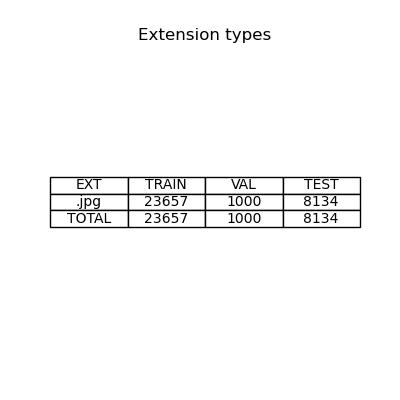

# Detector COCO-2017

Детектор `YOLO11` на урезанном датасете `COCO-2017`

## Быстрый старт

### Установка

```Bash
git clone https://github.com/YusayuSharingan/coco-detector.git
cd сoco-detector
pip install -r requirements.txt
```

### Запуск

```Bash
dvc repro
```


## Процесс обучения

### Анализ датасета

При вырезании из `COCO` 20% данных получился датасет на 80 классов, ниже приведена таблица классов на стадиях `train` и `val` 

<p align="center">
    
</p>

Суммарно в датасет попало 23657 на `train`, 1000 на  `val`. Стадия валидации получилась весьма скромной, однако этого количества должно хватить для более или менее правдоподобной оценки модели.

<p align="center">
    
</p>

Распределение классов в общем случае имеет довольно равномерный характер, однако присутствует явный перевес класса `person` и не недостаток классов `hair drier` и `toaster` в обоих папках. Кроме того в папку `val` попало явно меньше изображений класса `scissors`.

<p align="center">
    
</p>


Размерности изображений колебались от 150 до 640 пикселей. С одной стороны такие размеры удобны для последних версий `yolo`, которые обучают на картинках в `640x640`пикселей. С другой стороны жесткий `resize` по большей стороне слишком сильно исказит изображение. При этом категорически нельзя делать `crop`'ы, потому что присутсвует возможность потерять вхождения классов по краям изображений.

<p align="center">
    
</p>

График распределения средних размеров `bbox`'ов выглядит слежующим образом. Размеры приведены в координатах относительных к размерам изображения, чтобы увидеть какую часть картинки занимает класс.

Из гистограммы можно увидеть что классы `airplane`, `keyboard`, `train`, `bed` и `dining table` вытянуты по длине и часто занимают большую часть изображения.
Аналогично классы `giraffage`, `refrigerator`, `fire hydrant` и `horse` по высоте

При этом классы `bottle`, `sports ball` и `trafic light` имеют довольно низкие относительные размеры. Что может пораждать маленькие `bbox`'ы классов, которые сильно исказаятся при аугментациях и станут плохо классифицируемыми.

<p align="center">
    
</p>


### Обучение

Так как изначально `YOLO` обучался на датасете `COCO`, применение `transfer learning` не имеет смысла. При этом датасет из 20 000 картинок является довольно скромным для обучения с нуля `backbone` классификатора на 80 классов. Однако мощностей моего железа не хватит, чтобы за приемлемое время прогнать хотя бы 30-40% исходного датасета на 50 эпох обучения. Самым логичным решением попробовать оставить обученный backbone и обучать заново только ререссор координат `bbox`'ов. Но до этого шага, к сожалению, я дойти не успел :(

Максимальная модель которая влезла ко мне на видеокарту это `yolo11m`, ее я и использовал.

`YOLO` инкапсулирует механизм аугментаций  внутри модели, причем по умолчанию используется `randaug`. Я посчитал необходмым только задать низкую интенсивность аугментаций, чтобы классы с низким содержанием картинок получили дополнительное обобщение, однако сильные искажения не ухудшили обучение. Кроме того изображения имеют высокую контрастность и минимум визуальношо шума.
Размер картинок оставил стандартный `640x640`, так как на таких картинках "ёлки" и обучают.

Мне пришлось поставить довольно маленький `batch_size`, чтобы моделька влезла в память моей "gpu", что равязало мне руки относительно начального размера `learning rate`. За счет большого количества батчей механизм *backpropagation* множество раз корректирует веса, поэтому можно не бояться что градиентный спуск перепрыгнет минимум функции и не вернется к нему. Смело ставим `lr0 = 0.1`.

Оптимизатор я взял `AdamW`, как классический вариант оптимизатора, штрафы L2 оставил по умолчанию.

### Результаты обучения


В после 50 эпох обчения были получены следующие результаты. `cls_loss` оказался лучше, чем `dfl_loss`, и `mAP50-95` оказался выше `0.5`. Скорее всего это связано с тем, что я "дообучал" pretrained вурсию модели, и с тем, что `YOLO` имеют склонность завышать автоматически генерируемые оценки. Более адекватных результатов можно было бы получить на тестовых данных, где метрики можно было бы посчитать вручную, но стадию `evaluate.py`я дописать опять же не успел.

<p align="center">
    
</p>


Посмотрим на `confusion map`. Возьмем сразу нормированную матрицу, чтобы дучше видеть корреляцию классов.

Результаты жовольно забавные. Модель сильнее всего путает `carrot` и `orange`, `donut` и `toilet`, а так же `motocycle` и `boat`.

Мне понятны причины корреляции `orange` и `carrot` они часто находятся в похожей обстановке и имеют схожий цвет. Схожее отверстие имеют `donut` и `toilet`. Однако трудно установить причину корреляции `boat` и `motocycle`. Мое предположение - они часто имеют схожие размеры и, возможно, форма двигателя моторной лодки напоминает часть мотоцикла.

Все эти классы имеют близкое к среднему числу изображений, кроме того были использована взешенная функция потерь классификатора.

Решить проблему возможно, дообучая модель распозновать только по 2 коррелирующих класса. Кроме того,можно повыше поднять порог `confidence`, для отсеивания спорных случаев.  

<p align="center">
    
</p>

### Анализ метрик по классам

Классы с самыми низкими `mAP`, что неудивительно, совпали с самыми низкими классами по `recall` и `prescision`.

Классы `bottle` и `sport ball` имеют самые низкие `recal`'ы - порядка 0.2 на класс. Очевидно модель не замечает их и путает из-за маленького размера `bbox`. Предполагаю, что ситуацию исправит дообучение модели на более крупных кропах этих классов с более высоким разрешением. Это поможет модели впоследствии 
находить признаки этих мелких классов на нормальном изображении.

Еще одним классом с низким `prescicion` оказался  toaster. Но исходя из распределения классов, можно заключить что классу просту не хватает сэмплов изображения.


## TODO

- Попробовать обучить только регрессор модели
- Написать стадию оценки модели
- Написать стадию экспорта модели в onnx или tensorrt
